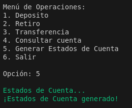

*Universidad de San Carlos de Guatemala*  
*Escuela de Ingeniería en Ciencias y Sistemas, Facultad de Ingenieria*  
*Sistema Operativos 2, Junio 2024.*  

___
## **Practica 2**
### **Multithreading**
___
**201944994 - Robin Omar Buezo Díaz**

**201908355 - Danny Hugo Bryan Tejaxún Pichiyá**

**201907774 - Dyllan José Rodrigo García Mejía**

#### **Resumen**
Esta práctica fue realizada con el objetivo de conocer acerta del funcionamiento de los hilos en Linux y como manejar el paralelismo y concurrencia al momento de utlizarlos y la forma correcta de manejar la sincronización entre los procesos.

El sistema resultante consiste en un sistema bancario que al inicio realiza una carga de usuario y también de operaciones que se almacenarán en el sistema para disponer de las cuentas de los usuarios. En esta carga de igual forma se generaran los logs de cada una para poder revisar que todo esté bien o en caso contrario poder conocer los errores.

Dentro del sistema se tiene la opción de realizar operaciones individuales de forma manual entre las cuentas de los usuarios y la opción de generar ciertos reportes.
___
#### **Introducción**  
El presente documento tiene como finalidad describir los puntos importantes del desarrollo del sistema para poder comprender de mejor forma su estructura y funcionamiento a nivel de código.  

Se busca profundizar en los puntos claves del funcionamiento del sistema como la carga masiva de usuarios y operaciones utilizando hilos, la generación de reportes y la funcionalidad de creación de operaciones individuales de forma manual.
___
___
### **Inicio del Sistema**
Al momento de iniciar el sistema, el usuario podrá visualizar lo siguiente.

#### **Carga de Usuarios**  
Al momento de iniciar el sistema se realiza de forma automática la carga de los usuarios al sistema, para ello es necesario contar en la carpeta del sistema, con un archivo `json` nombrado como `usuarios.json`, este debe de contar con la siguiente estructura.

~~~json
[
    {"no_cuenta": 1, "nombre": "María Pérez", "saldo": 2500.50},
    {"no_cuenta": 2, "nombre": "Juan Gómez", "saldo": 500.25},
    {"no_cuenta": 3, "nombre": "Ana Rodríguez", "saldo": 1000.00},
    {"no_cuenta": 4, "nombre": "Pedro Hernández", "saldo": 750.00}
]
~~~

Esta funcionalidad es llevada a cabo por medio de la función llamada `cargar_usuarios`, la cual, por medio de 3 hilos de forma paralela, se encarga de buscar el archivo de usuarios y luego recorrer dicho archivo para poder obtener cada uno de los usuario y realizar las respectivas validaciones de carga, si el usuario cumple con todas las validaciones entonces este es agregado al sistema, en caso contrario se registra el error en el siguiente archivo de log que se genera automáticamente al finalizar la carga por medio de la función `reporteCargaUsuarios`.

#### **Carga de Operaciones**  
Después de realizar la carga de usuarios en el sistema, se realiza de forma automática la carga de las operaciones, para ello es necesario contar en la carpeta del sistema, con un archivo `json` nombrado como `operaciones.json`, este debe de contar con la siguiente estructura.

~~~json
[
    {"operacion": 1, "cuenta1": 1, "cuenta2": 0, "monto": 300.00},
    {"operacion": 2, "cuenta1": 2, "cuenta2": 0, "monto": 100.25},
    {"operacion": 3, "cuenta1": 3, "cuenta2": 4, "monto": 200.00},
    {"operacion": 1, "cuenta1": 5, "cuenta2": 0, "monto": 500.00}
]
~~~

Esta funcionalidad es llevada a cabo por medio de la función llamada `cargar_operaciones`, la cual, por medio de 4 hilos de forma concurrente, se encarga de buscar el archivo de operaciones y luego recorrer dicho archivo para poder obtener cada una de los operaciones y realizar las respectivas validaciones de carga, si la operación cumple con todas las validaciones entonces esta se registra en el sistema, en caso contrario se registra el error en el siguiente archivo de log que se genera automáticamente al finalizar la carga por medio de la función `reporteCargaOperaciones`.

#### **Depósito**  
En el menú, la primera opción que tenemos es la del depósito, el cual es manejado por la función `deposito` y que se realiza de la siguiente manera.

#### **Retiro**  
En el menú, la segunda opción que tenemos es la del retiro, el cual es manejado por la función `retiro` y que se realiza de la siguiente manera.

#### **Transferencia**  
En el menú, la tercera opción que tenemos es la de transferencia, la cual es manejado por la función `transferencia` y que se realiza de la siguiente manera.

#### **Consultar cuenta**  
En el menú, la cuarta opción que tenemos es la de Consultar cuenta, la cual es manejado por la función `consultar_cuenta` y que se realiza de la siguiente manera.

#### **Generar Estados de Cuenta**  
En el menú la quinta opción que tenemos es la de Generar Estados de Cuenta, la cual es manejada por la función `reporteEstadosCuenta`.

Esta función nos genera un archivo `json` con la siguiente estructura.
~~~json
[
    {
        "no_cuenta": 1,
        "nombre": "María Pérez",
        "saldo": 3250.0
    },
    {
        "no_cuenta": 2,
        "nombre": "Juan Gómez",
        "saldo": 299.25
    },
    {
        "no_cuenta": 3,
        "nombre": "Ana Rodríguez",
        "saldo": 300.0
    }
]
~~~