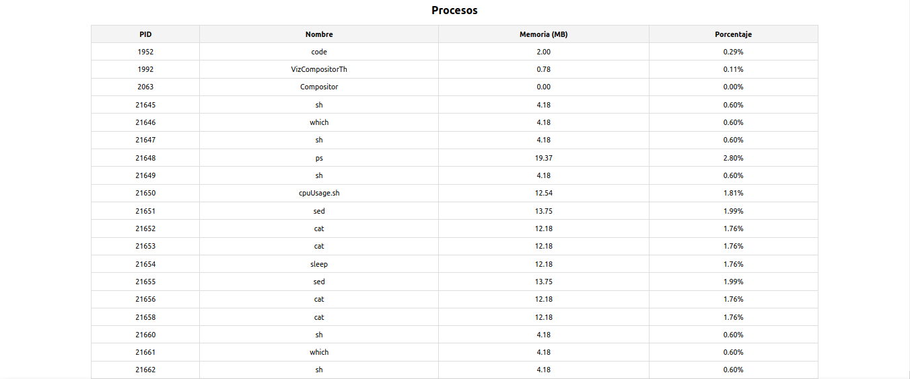
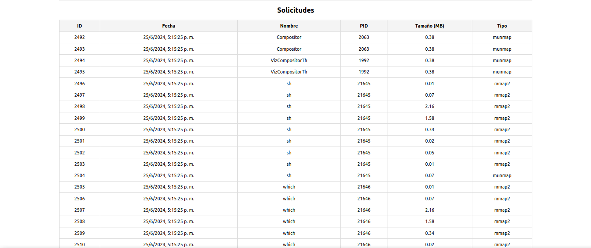

*Universidad de San Carlos de Guatemala*  
*Escuela de Ingeniería en Ciencias y Sistemas, Facultad de Ingenieria*  
*Sistema Operativos 2, Junio 2024.*  

___
## **Practica 1**
### **Monitoreo de llamadas del sistema con SystemTap**
___
**201944994 - Robin Omar Buezo Díaz**

**201908355 - Danny Hugo Bryan Tejaxún Pichiyá**

**201907774 - Dyllan José Rodrigo García Mejía**

#### **Resumen**
Esta proyecto fue realizado con el objetivo de conocer acerta de la gestión de la memoria, las solicitudes de memoria de los procesos y la manera de poder monitorear cada uno de estos utilizando herramientas como Systemtap.

El sistema resultante consiste en las capturar las solicitudes de memoria de todos los procesos activos. Estas solicitudes son realizadas por medio de estas llamadas al sistema:  
~~~ c
void *mmap(void addr[.length], size_t length, int prot, int flags, int fd, off_t offset);
int munmap(void addr[.length], size_t length);
~~~
Luego estás operaciones son monitoreadas por medio de Systemap y leidas mediante un programa en *C* que envía la información importante a una base de datos alojada en el servicio RDS de Amazon Web Services.
___
#### **Introducción**  
El presente documento tiene como finalidad describir los puntos importantes del desarrollo del sistema para poder comprender de mejor forma su estructura y funcionamiento a nivel de código.  

Se busca profundizar en los puntos claves del funcionamiento del sistema como la captura de las solicitudes de memoria, el script de Systemtap que se encarga de monitorear dichas solicitudes.
___
### Ejecución del Script de Systemtap
~~~bash
sudo stap memory_tracker.stp > memory_tracker.log
~~~

### Instalación de la librería para conexión con la base de datos MySQL
~~~bash
sudo apt-get install libmysqlclient-dev
~~~

### Compilación del Lector escrito en *C*
~~~bash
gcc reader.c -o reader -lmysqlclient
~~~

### Script SystemTap
**mmap()** crea una nueva asignación en el espacio de direcciones virtuales del proceso de llamada. La dirección inicial para la nueva asignación se especifica en addr. El argumento de length especifica la longitud del mapeo (que debe ser mayor que 0).  
La llamada al sistema **munmap()** elimina las asignaciones para el rango de direcciones especificado.  
La captura de estas llamadas se realizaran por medio del siguiente script de SystemTap:
~~~c
probe syscall.mmap2 {
    printf("%-10s%-8d%-25s%-20d%s\n", name, pid(), execname(), length, tz_ctime(gettimeofday_s()))
}

probe syscall.munmap {
    printf("%-10s%-8d%-25s%-20d%s\n", name, pid(), execname(), length, tz_ctime(gettimeofday_s()))
}
~~~

### Lector
* **stdio.h**: Proporciona las funciones estándar para entrada y salida, como printf y fgets.
* **stdlib.h**: Contiene las funciones estándar de utilidad, como system, atoi, y funciones de gestión de memoria (malloc, free).
* **string.h**: Define varias funciones para manipular cadenas de caracteres, como strcpy, strcmp, y sprintf.
* **ctype.h**: Contiene funciones para la clasificación de caracteres, como isdigit.
* **unistd.h**: Define las constantes y funciones de la API de POSIX, como sleep y getenv.
* **time.h**: Proporciona funciones para manipular y formatear la fecha y hora.
* **mysql/mysql.h**: Encabezado de la biblioteca cliente de MySQL, que proporciona funciones y estructuras para interactuar con un servidor MySQL desde una aplicación en C.
~~~ c
#include <stdio.h>
#include <stdlib.h>
#include <string.h>
#include <ctype.h>
#include <unistd.h>
#include <time.h>
#include <mysql/mysql.h>
~~~
Se utilizó para definir un número máximo de líneas para leer del archivo **.stp** que se detalla más adelante.
~~~ c
#define MAX_LINE_LENGTH 256
~~~
Define una estructura llamada **data** que contiene los campos necesarios para almacenar información sobre el uso de memoria. Esto incluye el PID del proceso, el nombre del segmento de memoria, el tipo de llamada, el tamaño del segmento y la fecha y hora de la asignación.
~~~ c
struct data {
    int pid;
    char nombre[100];
    char tipo[15];
    int tamano;
    char fecha[20];
};
~~~
La función **monthToNum** convierte el nombre abreviado de un mes en su número correspondiente en formato de dos dígitos (por ejemplo, "Jan" a "01", "Feb" a "02", etc.). Utiliza strcmp para comparar cadenas y strcpy para copiar el resultado en month_num. Retorna un puntero a month_num.
~~~ c
char* monthToNum(char *month) {
    static char month_num[3];

    if (strcmp(month, "Jan") == 0) strcpy(month_num, "01");
    else if (strcmp(month, "Feb") == 0) strcpy(month_num, "02");
    else if (strcmp(month, "Mar") == 0) strcpy(month_num, "03");
    else if (strcmp(month, "Apr") == 0) strcpy(month_num, "04");
    else if (strcmp(month, "May") == 0) strcpy(month_num, "05");
    else if (strcmp(month, "Jun") == 0) strcpy(month_num, "06");
    else if (strcmp(month, "Jul") == 0) strcpy(month_num, "07");
    else if (strcmp(month, "Aug") == 0) strcpy(month_num, "08");
    else if (strcmp(month, "Sep") == 0) strcpy(month_num, "09");
    else if (strcmp(month, "Oct") == 0) strcpy(month_num, "10");
    else if (strcmp(month, "Nov") == 0) strcpy(month_num, "11");
    else if (strcmp(month, "Dec") == 0) strcpy(month_num, "12");
    else strcpy(month_num, "00");

    return month_num;
}
~~~
La función **set_env** abre un archivo y lee líneas para establecer variables de entorno utilizando setenv. Cada línea del archivo debe estar en formato clave=valor.
~~~ c
void set_env(const char *filename){
    FILE *file = fopen(filename, "r");
    if (file == NULL) {
        perror("Error abriendo el archivo");
        exit(1);
    }

    char line[MAX_LINE_LENGTH];
    while (fgets(line, sizeof(line), file)) {
        line[strcspn(line, "\n")] = 0;

        char *delimiter = strchr(line, '=');
        if (!delimiter) {
            continue;
        }

        *delimiter = 0;
        char *key = line;
        char *value = delimiter + 1;

        if (setenv(key, value, 1) != 0) {
            perror("Error al establecer variable de entorno");
            exit(1);
        }
    }

    fclose(file);
}
~~~
La función **process_line** procesa una línea del archivo de registro (memory_tracker.log) que contiene datos sobre el uso de memoria. Extrae información relevante como el tipo de llamada, PID, nombre del segmento de memoria, tamaño, y fecha/hora, y luego construye una consulta SQL para insertar estos datos en una tabla de la base de datos MySQL utilizando la conexión conn.
~~~ c
void process_line(char *line, MYSQL *conn) {
    char call[10], name[20], _[3], month[4], numDay[3], time[9], year[5];
    int pid, size;

    sscanf(line, "%s %d %s %d %s %s %s %s %s", call, &pid, name, &size, _, month, numDay, time, year);

    struct data data;
    data.pid = pid;
    strcpy(data.nombre, name);
    strcpy(data.tipo, call);
    data.tamano = size;
    sprintf(data.fecha, "%s-%s-%s %s", year, monthToNum(month), numDay, time);

    char query[500];
    sprintf(query, "INSERT INTO Memoria (pid, nombre, tipo, tamano, fecha) VALUES (%d, '%s', '%s', %d, '%s')", data.pid, data.nombre, data.tipo, data.tamano, data.fecha);

    if (mysql_query(conn, query)) {
        fprintf(stderr, "%s\n", mysql_error(conn));
    } else {
        printf("Llamada: %s, PID: %d, Nombre: %s, Tamaño Segmento: %d, Fecha Hora: %s-%s-%s %s\n", call, pid, name, size, year, monthToNum(month), numDay, time);
    }
}
~~~
#### Función Main
* Carga las variables de entorno desde un archivo .env.
* Establece una conexión a la base de datos MySQL utilizando las credenciales obtenidas de las variables de entorno.
* Inicia el monitoreo de memoria utilizando SystemTap ejecutando un script llamado memory_tracker.stp.
* Abre el archivo de registro (memory_tracker.log), procesa nuevas líneas de datos que llegan, y las almacena en la base de datos MySQL utilizando la función process_line.
~~~ c
int main() {
    set_env("../.env");
    // Conexión a base de datos
    MYSQL *conn;
    MYSQL_RES *res;
    MYSQL_ROW row;

    char *server = getenv("MYSQL_HOST");
    char *user = getenv("MYSQL_USER");
    char *password = getenv("MYSQL_PASS");
    char *database = getenv("MYSQL_DB");

    conn = mysql_init(NULL);

    if (!mysql_real_connect(conn, server, user, password, database, 0, NULL, 0)) {
        fprintf(stderr, "%s\n", mysql_error(conn));
        return 1;
    }

    // Iniciar systemtap
    int result = system("sudo stap memory_tracker.stp > memory_tracker.log 2>/dev/null &");
    if (result == -1) {
        perror("system");
        return 1;
    }

    sleep(1);

    // Leer archivo
    FILE *file;
    char line[MAX_LINE_LENGTH];
    long last_pos = 0;

    file = fopen("memory_tracker.log", "r");
    if (!file) {
        perror("Error abriendo el archivo");
        return 1;
    }

    // fseek(file, 0, SEEK_END); // Puntero en final de archivo

    while (1) {
        last_pos = ftell(file); // Posición actual del puntero

        // Leer nuevas líneas
        while (fgets(line, MAX_LINE_LENGTH, file) != NULL) {
            // Procesar línea y guardar en base de datos
            process_line(line, conn);
        }

        sleep(1);

        fseek(file, last_pos, SEEK_SET); // Mover puntero al final de archivo
    }

    fclose(file);

    return 0;
}
~~~
### Base de Datos MySQL
~~~ sql
DROP DATABASE IF EXISTS Proyecto1;
CREATE DATABASE Proyecto1;
USE Proyecto1;

CREATE TABLE Memoria(
    id INT PRIMARY KEY AUTO_INCREMENT,
    pid INT,
    nombre VARCHAR(100),
    tipo VARCHAR(15),
    tamano BIGINT,
    fecha TIMESTAMP
);
~~~
### API
* **Flask**: Un framework web ligero para Python que permite crear aplicaciones web rápidamente.
* **flask_cors**: Extensión de Flask para manejar CORS (Cross-Origin Resource Sharing), permitiendo que el servidor responda a solicitudes desde un origen diferente al de la página que realiza la solicitud.
* **mysql.connector**: Una biblioteca de Python que facilita la interacción con bases de datos MySQL desde aplicaciones Python.
* **dotenv**: Biblioteca para cargar variables de entorno desde un archivo .env.
* **os**: Módulo estándar de Python para interactuar con el sistema operativo, utilizado aquí para manipular rutas de archivos y acceder a variables de entorno.
~~~ python
from flask import Flask, jsonify
from flask_cors import CORS
from mysql import connector
import dotenv
import os
~~~
* Crea una instancia de la aplicación Flask.
* Configura CORS en la aplicación Flask para permitir peticiones desde cualquier origen.
* Carga las variables de entorno desde un archivo .env.
* Establece la conexión a la base de datos MySQL utilizando las credenciales y la información de conexión proporcionadas en las variables de entorno.
~~~ python
app = Flask(__name__)
CORS(app)

dotenv.load_dotenv(os.path.join(os.path.dirname(__file__), '..', '.env'))

try:
    db = connector.connect(
        host=os.getenv('MYSQL_HOST'),
        user=os.getenv('MYSQL_USER'),
        password=os.getenv('MYSQL_PASS'),
        database=os.getenv('MYSQL_DB')
    )
except connector.Error as e:
    print(e)

cursor = db.cursor()
~~~
* Define un endpoint para manejar solicitudes GET a la ruta /api/procesos.
* Ejecuta una consulta SQL en la base de datos para obtener información sobre el uso de memoria de los procesos.
* Proporciona la descripción de las columnas resultantes de la consulta.
* Convierte el resultado de la consulta a un objeto JSON para ser devuelto como respuesta HTTP.
~~~ python
@app.route('/api/procesos', methods=['GET'])
def get_procesos():
    if db is None:
        return jsonify({'error': 'No se pudo conectar a la base de datos'})
    
    cursor.execute('''
            SELECT  pid,
                    nombre,
                    GREATEST(SUM(CASE WHEN tipo = 'mmap2' THEN tamano ELSE tamano * -1 END),0)/1024/1024 memoria_mb,
                    ROUND(GREATEST(SUM(CASE WHEN tipo = 'mmap2' THEN tamano ELSE tamano * -1 END),0) /
                        (SELECT SUM(porcentaje)
                        FROM (SELECT GREATEST(SUM(CASE WHEN tipo = 'mmap2' THEN tamano ELSE tamano * -1 END),0) porcentaje
                            FROM Memoria
                            GROUP BY pid, nombre) total
                        ) * 100, 2) porcentaje
            FROM Memoria
            GROUP BY pid, nombre
            ORDER BY pid
        ''')
    
    columns = [desc[0] for desc in cursor.description]
    result = [dict(zip(columns, row)) for row in cursor.fetchall()]
    return jsonify(result)
~~~
* Define un endpoint para manejar solicitudes GET a la ruta /api/solicitudes.
* Ejecuta una consulta SQL en la base de datos para obtener información detallada sobre las solicitudes de memoria.
* Funciona de manera similar al endpoint anterior, extrayendo y formateando los datos de la base de datos en formato JSON para ser devueltos como respuesta HTTP.
~~~ python
@app.route('/api/solicitudes', methods=['GET'])
def get_solicitudes():
    if db is None:
        return jsonify({'error': 'No se pudo conectar a la base de datos'})
    
    cursor.execute('''
            SELECT  id,
                    pid,
                    nombre,
                    tipo,
                    tamano tamano_bytes,
                    ROUND(GREATEST(tamano/1024/1024,0), 2) tamano_mb,
                    fecha
            FROM Memoria
            ORDER BY id
        ''')
    
    columns = [desc[0] for desc in cursor.description]
    result = [dict(zip(columns, row)) for row in cursor.fetchall()]
    return jsonify(result)
~~~
Inicia el servidor web Flask para manejar las solicitudes entrantes en la dirección IP 0.0.0.0 en el puerto 5000.
~~~ python
if __name__ == '__main__':
    app.run(host='0.0.0.0', port=5000)
~~~
### Dashboard
#### Gráfico de Uso

#### Tabla de Procesos

#### Tabla de Solicitudes
